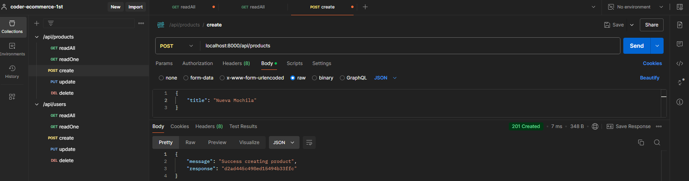
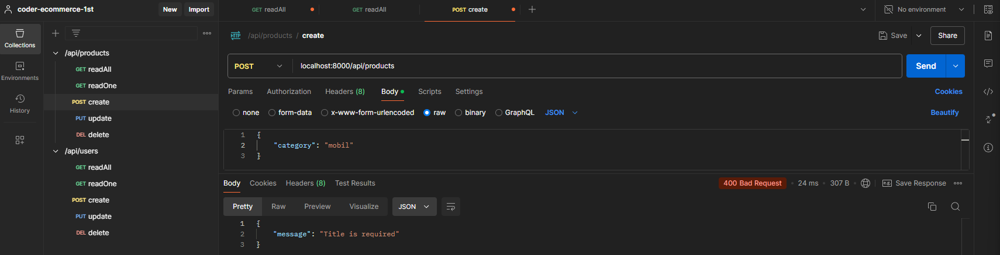
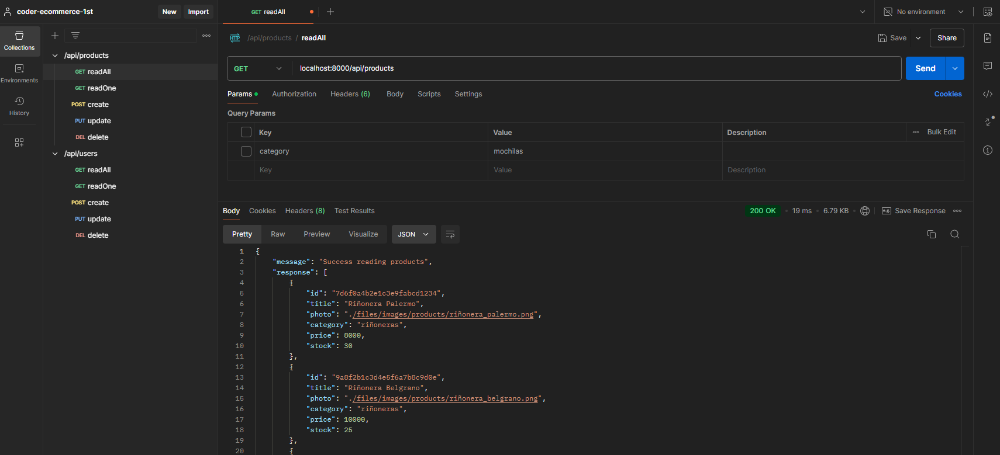
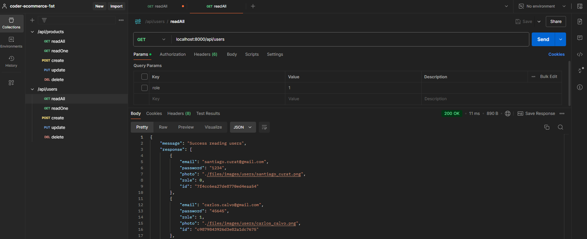
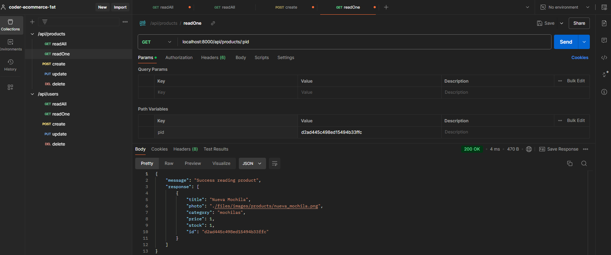
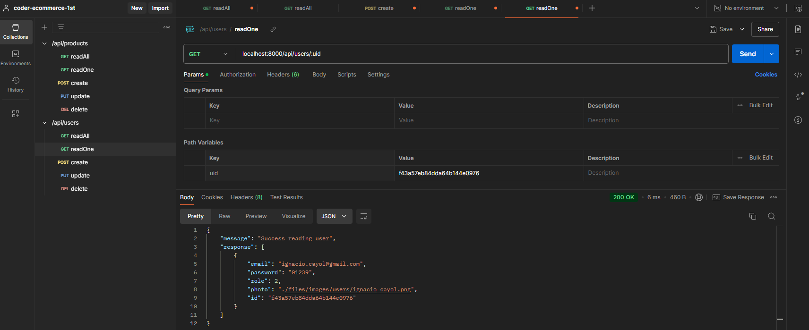
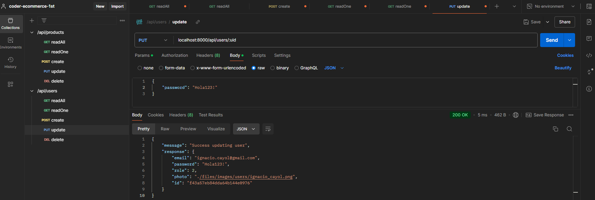
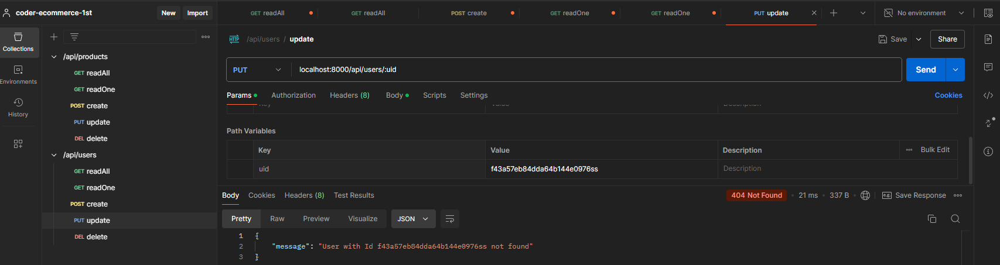
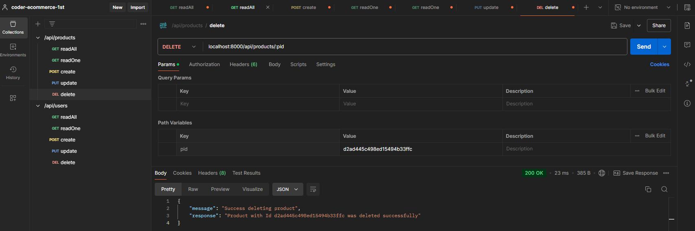
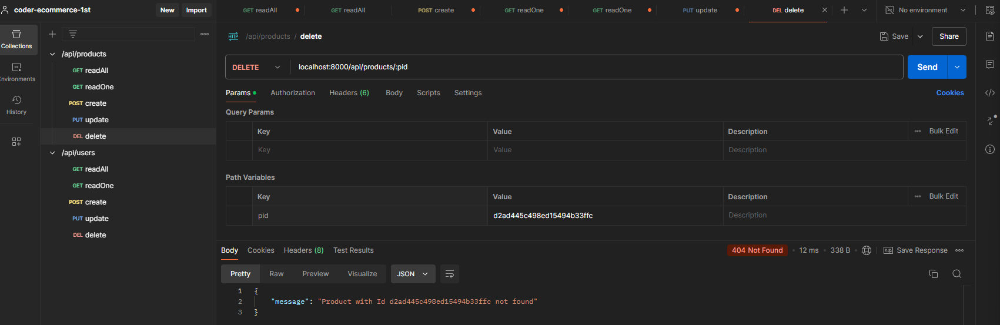

# 1ra entrega

Se creo un gestor de productos (40 pre-cargados) y usuarios (4 pre-cargados) armacenados en archivos de formato JSON.

### Productos:

-   id → código autogenerado automáticamente de 12 bytes y headecimal
-   title → título del producto. Campo obligatorio
-   photo → ruta a la imagen del producto. En caso de no aportarse, se genera automáticamente
-   category → categoría del producto. En caso de no aportarse, se genera automáticamente
-   price → precio del producto. En caso de no aportarse, se genera automáticamente
-   stock → stock del producto. En caso de no aportarse, se genera automáticamente

### Usuarios:

-   id → código autogenerado automáticamente de 12 bytes y headecimal
-   photo → ruta a la imagen del usuario. En caso de no aportarse, se genera automáticamente
-   email → email del usuario. Campo obligatorio
-   password → contraseña del usuario. Campo obligatorio
-   rol → rol del usuario. En caso de no aportarse, se genera automáticamente

### El servidor cuenta con la opción de:

-   create → crear un nuevo recurso
    
    

-   readAll → leer todos los recursos
    
    

-   readOne → leer un recurso particular mediante su Id
    
    

-   update → actualizar un recurso
    
    

-   delete → eliminar un recurso
    
    

Los errores son manejados mediante un errorHandler. 
Las rutas no existentes son manejadas mediante un pathHandler.
